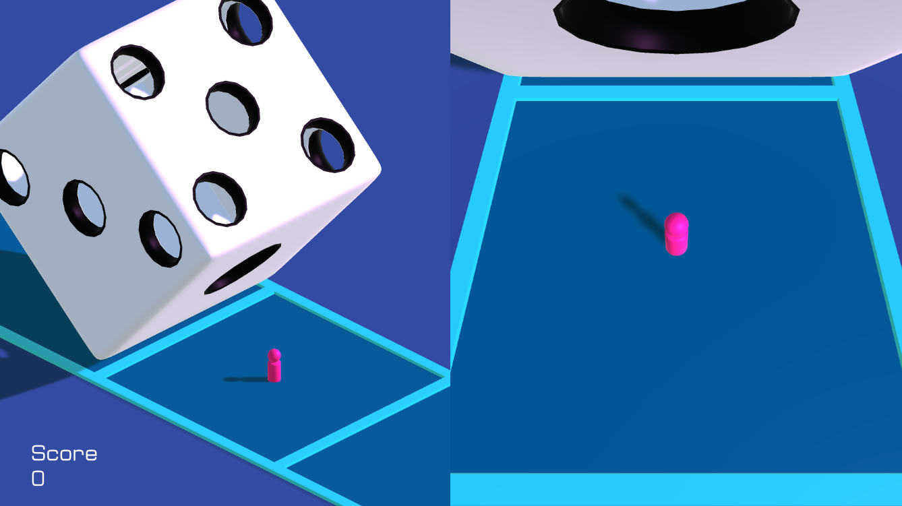

# Dice Inside

A tiny game about avoiding dice entering through their corresponding holes, developed for the **GMTK Game Jam 2022**.

Use arrow keys to move

## Play the Game

[itch.io game page](https://curiositypath.itch.io/dice-inside)

## Credits

### Development
- **Alberto del Real** ([@del-Real](https://github.com/del-Real))
- **Paul Andrei Taranu** ([@PaulAndreiTaranu](https://github.com/PaulAndreiTaranu))

### Music
- Origami Repetika / *Attribution 4.0 International (CC BY 4.0)*
